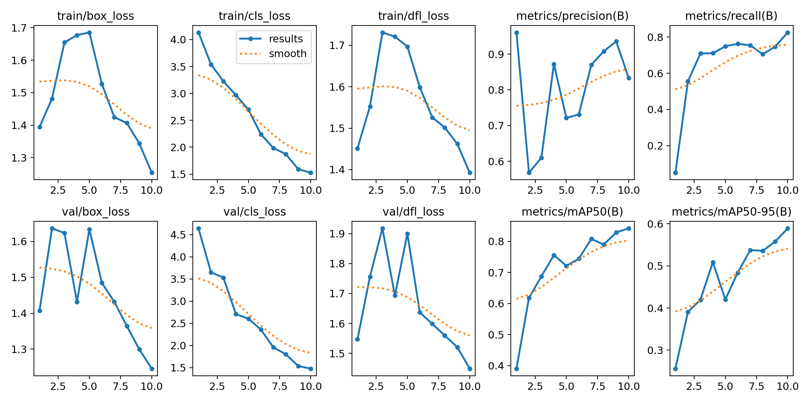

# Robotics Navigation Perception Module

## Overview

The goal of this assignment was to build a simple perception module for a robot.
The system should detect a few important road objects and estimate how far they are from the camera.

The three objects considered in this project are:

* Traffic Cones
* Road Barriers
* Stop Signs

After detecting these objects, the system estimates their distance using a simple geometric relation based on the **pinhole camera model**.

The model is trained using **YOLOv8 Nano** with transfer learning, and the final model is exported to **ONNX** so it can run on lightweight or edge hardware.


## 1. Object Detection

The assignment mentioned the **BDD100K dataset**, but training on the full dataset was not practical on my system because I only had CPU compute and limited time.

Instead, I collected smaller datasets for the required objects from **Roboflow** and merged them together. These datasets already had annotations, but they used different class IDs.

To combine them into a single dataset, I wrote small Python scripts to:

* remap class IDs
* remove invalid labels
* merge the datasets
* split the data into train / validation / test sets

Final dataset size:

Train images: **812**
Validation images: **102**
Test images: **102**

Classes used:

0 → cone
1 → barrier
2 → stop_sign

For the model, I used **YOLOv8 Nano** because it is lightweight and suitable for edge devices.

Training was done for **10 epochs on CPU**.


## 2. Distance Estimation

After detecting objects, the next step is estimating how far they are from the camera.

For this I used a basic **pinhole camera approximation**.

Distance formula used:

Distance = (Real Width × Focal Length) / Pixel Width

Approximate real-world sizes used:

Cone ≈ 0.3 m
Barrier ≈ 1.5 m
Stop Sign ≈ 0.75 m

Assumed focal length = **800**

Using this, the model outputs labels like:

Cone: 1.4m
Stop Sign: 8.5m

This is only an approximation because the camera was not calibrated, but it gives a reasonable estimate.


## 3. Edge Optimization

Since the final goal is to run this on limited hardware, the trained PyTorch model was exported to **ONNX format**.

Benefits of ONNX:

* lighter runtime
* easier deployment
* faster inference compared to full PyTorch

The export script checks the available hardware:

* If GPU is available → export using FP16
* If CPU only → export using FP32

This avoids crashes when running on CPU systems.


## 4. Performance

Testing was done on my local machine:

CPU: **AMD Ryzen 5 5625U**

Observed inference speed:

~ **0.2 FPS**

This is expected for CPU inference with object detection models.
If deployed on a small GPU edge device like **Jetson Nano**, the speed would improve significantly.


## 5. Training Results

Below is the training graph generated by YOLO during training.



Some observations:

* Loss decreases gradually across epochs
* Precision and recall improve during training
* Final validation mAP50 is around **0.84**

Considering the small dataset and CPU training, this result is acceptable for a prototype.


## 6. Example Outputs

Some example detections are shown below.

### Street Scene


### Barrier Detection


### Stop Sign Detection


Each bounding box shows:

* the detected object
* estimated distance from the camera

If an image does not contain cones, barriers, or stop signs, the model correctly returns **no detections**, which helps avoid false alarms.


## 7. Limitations

Since this project was developed quickly with limited compute resources, there are some limitations:

* The barrier class has fewer examples compared to cones
* Some unusual barrier types may not be detected
* Distance estimation is approximate because the camera is not calibrated
* Training was limited to only **10 epochs**

With more data and longer training, performance could be improved.


## 8. Possible Improvements

Some improvements that could be explored:

* Train on a larger dataset (e.g., BDD100K subset)
* Clean more data to perform **Data Engineering** well by remove the duplicates, unnatural, irrelevant white background "images"
* Increase training epochs
* Add stronger data augmentation
* Deploy and benchmark on an edge GPU
* Apply bird’s-eye view transformation using homography for navigation

## How to Run

Install dependencies:

```bash
pip install -r requirements.txt
```

Train the model:

```bash
python train.py
```

Run detection and distance estimation:

```bash
python detect_distance.py
```

The annotated images will be saved inside the **outputs/** folder.

